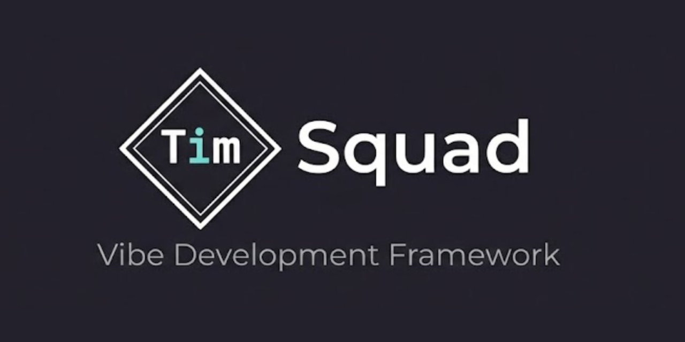

<p align="center">
  
</p>

<p align="center">
  <strong>Vibe Development Framework</strong><br>
  SSOT 기반 문서 체계, 최적화된 에이전트 롤, 회고적 학습을 통해 Claude Code에서 지속적으로 개선되는 고품질 소프트웨어 생성 프레임워크
</p>

<p align="center">
  <a href="README.md">English</a> | <strong>한국어</strong>
</p>

```
최적화된 롤 정의 + 고도화된 스킬 + 회고적 학습 = 지속적으로 개선되는 고품질 결과물
```

---

## Why TimSquad?

| | 일반적 접근 | **TimSquad** |
|---|---------|------------|
| 철학 | "Zero learning curve" | **"체계를 세우면 더 잘 된다"** |
| 의사결정 | LLM이 알아서 | **개발자가 컨트롤** |
| 우선순위 | 속도 | **품질 + 일관성** |
| 강제성 | 프롬프트만 (소프트) | **Hook Gate + Capability Token (하드)** |
| 학습 | 없음 | **회고적 학습으로 지속 개선** |

**For developers who want structure, not magic.**

### 타겟 사용자

- 체계적인 프로세스를 원하는 시니어 개발자
- 1인 CTO / 테크 리드 (혼자서 팀 수준의 품질 필요)
- 문서화와 일관성을 중시하는 개발자

---

## 설치

```bash
# 전역 설치
npm install -g timsquad

# 또는 npx로 직접 실행
npx timsquad init
```

**요구사항:**
- Node.js >= 18.0.0
- [Claude Code](https://claude.ai/claude-code) (에이전트 실행 환경)

---

## 빠른 시작

### 1. 프로젝트 초기화

```bash
tsq init                                      # 대화형 초기화
tsq init -n my-app -t web-service -l 2 -y     # 비대화형
```

### 2. 생성되는 구조

```
my-app/
├── CLAUDE.md                      # PM 역할 (자동 주입 ~15줄)
├── .claude/
│   ├── settings.json              # Claude Code 설정 (13개 Hook)
│   ├── rules/                     # 경로별 규칙 (15개)
│   ├── agents/                    # 7개 전문 에이전트
│   │   ├── tsq-architect.md       # 아키텍처 설계
│   │   ├── tsq-developer.md       # 코드 구현
│   │   ├── tsq-qa.md              # 검증/리뷰
│   │   ├── tsq-security.md        # 보안 검토
│   │   ├── tsq-dba.md             # DB 설계
│   │   ├── tsq-designer.md        # UI/UX 설계
│   │   └── tsq-librarian.md       # Phase 기록
│   ├── skills/                    # tsq-* 스킬 (프로젝트 타입에 따라 선택)
│   │   ├── tsq-protocol/          # 에이전트 공통 프로토콜
│   │   ├── tsq-controller/        # Context DI + 위임
│   │   ├── tsq-coding/            # 코딩 규칙
│   │   ├── tsq-testing/           # 테스트 전략
│   │   ├── tsq-typescript/        # TypeScript 패턴
│   │   ├── tsq-react/             # React (설정 시)
│   │   ├── tsq-nextjs/            # Next.js + Vercel 룰
│   │   ├── tsq-database/          # DB 설계
│   │   ├── tsq-product-audit/     # 제품 감사 (7개 영역)
│   │   ├── tsq-tdd/               # TDD 방법론
│   │   └── ...                    # 기타 (설정에 따라)
│   └── knowledge/                 # 에이전트 참조 지식
└── .timsquad/
    ├── config.yaml                # 프로젝트 설정
    ├── ssot/                      # SSOT 문서 (레벨별 5~14개)
    ├── process/                   # 워크플로우 정의
    ├── state/                     # 상태 관리
    ├── scripts/                   # 자동화 스크립트 (6개)
    ├── trails/                    # Phase 사고과정 아카이브
    ├── logs/                      # 3계층 로그 (L1→L2→L3)
    └── retrospective/             # 회고 데이터
```

### 3. Claude Code에서 작업

```bash
claude                                    # Claude Code 실행

# 슬래시 커맨드로 모든 작업 수행
/tsq-start                               # 파이프라인 시작 + 온보딩
/tsq-quick 로그인 버튼 색상 수정          # 단일 태스크 (Controller 경유)
/tsq-full                                # 풀 파이프라인 (Phase-Sequence-Task)
/tsq-status                              # 현재 상태 확인
/tsq-grill                               # Sub-PRD 심층 인터뷰
/tsq-decompose                           # Phase-Sequence-Task 계획 생성
```

### 4. CLI 명령어

```bash
tsq init                          # 프로젝트 초기화
tsq update                        # 스킬/에이전트 최신화
tsq daemon start                  # 백그라운드 데몬 시작
```

> 나머지 기능은 Claude Code 슬래시 커맨드로 전환되었습니다. [CLI 레퍼런스](docs/cli.md) 참조.

---

## 핵심 기능

### 5-Layer 강제 아키텍처

```
Layer 1: Hook Gate (100% 강제)
  └ PreToolUse 훅 + Capability Token — 시스템 레벨 차단

Layer 2: Skill Protocol (90-95% 준수)
  └ tsq-protocol + controller — 프로세스 안내
  └ 에이전트별 스킬 skills: 필드로 프리로드

Layer 3: CLAUDE.md (역할 정의만)
  └ PM 역할 + 파이프라인 사전조건 (~15줄)

Layer 4: 슬래시 커맨드 (명시적 프로세스)
  └ /tsq-start, /tsq-quick, /tsq-full, /tsq-status, /tsq-grill, /tsq-retro

Layer 5: 감사 (비동기 사후 추적)
  └ 데몬이 관찰 → 세션 로그, 메트릭
  └ 데몬 장애 시 메인 파이프라인에 영향 없음
```

### SSOT 문서 체계

프로젝트 레벨에 따라 필수 문서가 자동 결정됩니다:

| 레벨 | 필수 문서 | 대상 |
|------|----------|------|
| **Level 1** (MVP) | PRD, Planning, Requirements, Service Spec, Data Design (5개) | 사이드 프로젝트, PoC |
| **Level 2** (Standard) | Level 1 + 6개 추가 (11개) | 일반 프로젝트, 스타트업 |
| **Level 3** (Enterprise) | Level 2 + 3개 추가 (14개) | 엔터프라이즈, fintech |

### 에이전트 시스템

7개 전문 에이전트 + Controller 기반 위임:

| 에이전트 | 역할 |
|----------|------|
| `@tsq-architect` | 아키텍처 설계, ADR, 계획 검증 |
| `@tsq-developer` | SSOT 기반 코드 구현, TDD |
| `@tsq-qa` | 코드 리뷰, 테스트 검증, SSOT 적합성 |
| `@tsq-security` | 보안 검증, OWASP, 취약점 분석 |
| `@tsq-dba` | DB 설계, 쿼리 최적화, 마이그레이션 |
| `@tsq-designer` | UI/UX 설계, 접근성, 디자인 토큰 |
| `@tsq-librarian` | Phase 기록, 메모리 관리 |

### 37개 스킬 (슬래시 커맨드)

모든 스킬은 `tsq-*` flat namespace로 통일되었으며 슬래시 커맨드로 사용:

| 카테고리 | 스킬 |
|----------|------|
| **핵심** | `tsq-protocol`, `tsq-controller`, `tsq-start`, `tsq-quick`, `tsq-full`, `tsq-status` |
| **코딩** | `tsq-coding`, `tsq-testing`, `tsq-typescript`, `tsq-hono` |
| **기획** | `tsq-planning`, `tsq-spec`, `tsq-grill`, `tsq-decompose` |
| **프론트엔드** | `tsq-react`, `tsq-nextjs`, `tsq-ui` |
| **백엔드** | `tsq-database`, `tsq-prisma`, `tsq-security` |
| **모바일** | `tsq-dart`, `tsq-flutter` (+ 하위 스킬 6개) |
| **품질** | `tsq-product-audit`, `tsq-audit`, `tsq-stability` |
| **방법론** | `tsq-tdd`, `tsq-bdd`, `tsq-ddd`, `tsq-debugging` |
| **운영** | `tsq-librarian`, `tsq-log`, `tsq-retro`, `tsq-prompt` |

### 13개 Hook Gate

| Hook | 스크립트 | 역할 | 전략 |
|------|---------|------|------|
| PreToolUse (Bash) | `safe-guard.sh` | 파괴적 명령 차단 | Fail-closed |
| PreToolUse (Write\|Edit) | `phase-guard.sh` | Phase별 파일 접근 제한 | Fail-closed |
| PreToolUse (Write\|Edit) | `check-capability.sh` | Capability Token 검증 | Fail-closed |
| PreToolUse (Write\|Edit) | `change-scope-guard.sh` | 변경 범위 추적 | Fail-open |
| Stop | `completion-guard.sh` | 테스트 + TDD + SSOT 확인 | Fail-closed |
| Stop | `build-gate.sh` | TypeScript 빌드 에러 | Fail-closed |
| PreCompact | `pre-compact.sh` | 컴팩션 전 상태 저장 | Fail-open |
| SessionStart (compact) | `context-restore.sh` | 컨텍스트 복원 + SSOT 안내 | Fail-open |

### 데몬 기반 자동화

**관찰자 전용 데몬** — 토큰 비용 0:

```
Claude Code 세션 → 데몬이 IPC로 관찰
  → L1 태스크 로그 기록 (SubagentStop 훅)
  → Decision Log 누적 (decisions.jsonl)
  → SSOT Drift 감지 (7일 초과 미갱신 경고)
  → 세션 메트릭 추적
  → 데몬 장애 시 파이프라인 차단 없음
```

---

## 프로젝트 타입

| 타입 | 설명 |
|------|------|
| `web-service` | SaaS, 풀스택 웹 서비스 |
| `web-app` | BaaS 기반 (Supabase/Firebase) |
| `api-backend` | API 서버, 마이크로서비스 |
| `platform` | 프레임워크, SDK |
| `fintech` | 거래소, 결제 (Level 3 강제) |
| `mobile-app` | 크로스플랫폼 모바일 앱 |
| `infra` | DevOps, 자동화 |

---

## 문서

| 문서 | 설명 |
|------|------|
| [PRD](docs/PRD.md) | 프레임워크 전체 기획 |
| [Core Concepts](docs/core-concepts.md) | 분수 모델, SSOT, 에이전트/스킬 구조 |
| [CLI Reference](docs/cli.md) | CLI 명령어 레퍼런스 |
| [File Structure](docs/file-structure.md) | 템플릿 + 초기화 후 구조 |
| [Hook Execution Order](docs/hook-execution-order.md) | Hook 실행 순서, Fail 전략 |
| [Log Architecture](docs/log-architecture.md) | 3계층 로그 체계 (L1→L2→L3) |
| [Feedback & Retrospective](docs/feedback-and-retrospective.md) | 피드백 라우팅 + 회고적 학습 |
| [SDCA Architecture](docs/sdca-architecture.md) | 스킬 주도 컨트롤러 아키텍처 |

---

## Theoretical Background

| 이론/논문 | 핵심 개념 | TimSquad 적용 |
|---------|---------|--------------|
| **Agentsway** (2025) | Prompting Agent, Retrospective Learning | 프롬프트 최적화, 회고적 학습 |
| **ACM TOSEM** (2025) | Competency Mapping | 역량 프레임워크, 성과 지표 |
| **Agentic SE** (2025) | AGENT.md, Meta-Prompt Files | 계층화된 메타-프롬프트 구조 |
| **FRAME** (2025) | Feedback-Driven Refinement | 레벨별 피드백 라우팅 |

---

## Contributing

기여를 환영합니다!

1. Fork the repository
2. Create your feature branch (`git checkout -b feature/amazing-feature`)
3. Commit your changes (`git commit -m 'feat: add amazing feature'`)
4. Push to the branch (`git push origin feature/amazing-feature`)
5. Open a Pull Request

---

## License

MIT License - see [LICENSE](LICENSE) for details.

---

## Related

- [Anthropic Skills](https://github.com/anthropics/skills)
- [Claude Code](https://claude.ai/claude-code)
