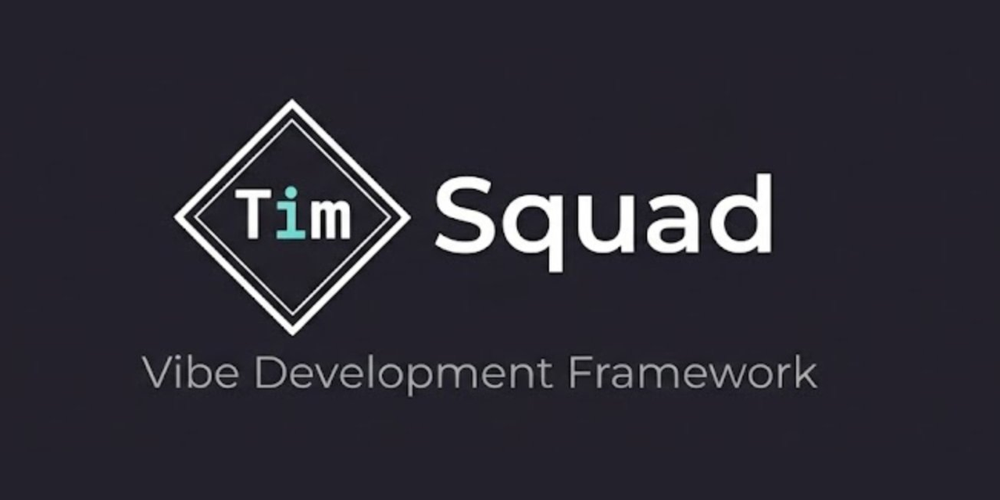

<p align="center">
  
</p>

<p align="center">
  <strong>Vibe Development Framework</strong><br>
  SSOT 기반 문서 체계, 최적화된 에이전트 롤, 회고적 학습을 통해 Claude Code에서 지속적으로 개선되는 고품질 소프트웨어 생성 프레임워크
</p>

```
최적화된 롤 정의 + 고도화된 스킬 + 회고적 학습 = 지속적으로 개선되는 고품질 결과물
```

---

## Why TimSquad?

| | 일반적 접근 | **TimSquad** |
|---|---------|------------|
| 철학 | "Zero learning curve" | **"체계를 세우면 더 잘 된다"** |
| 의사결정 | LLM이 알아서 | **개발자가 컨트롤** |
| 우선순위 | 속도 | **품질 + 일관성** |
| 반복 작업 | LLM이 처리 (토큰 소비) | **프로그램이 처리 (토큰 0)** |
| 학습 | 없음 | **회고적 학습으로 지속 개선** |

**For developers who want structure, not magic.**

### 타겟 사용자

- 체계적인 프로세스를 원하는 시니어 개발자
- 1인 CTO / 테크 리드 (혼자서 팀 수준의 품질 필요)
- 문서화와 일관성을 중시하는 개발자

---

## 설치

```bash
# 전역 설치
npm install -g timsquad

# 또는 npx로 직접 실행
npx timsquad init
```

**요구사항:**
- Node.js >= 18.0.0
- [Claude Code](https://claude.ai/claude-code) (에이전트 실행 환경)

---

## 빠른 시작

### 1. 프로젝트 초기화

```bash
tsq init                                      # 대화형 초기화
tsq init -n my-app -t web-service -l 2 -y     # 비대화형
```

### 2. 생성되는 구조

```
my-app/
├── CLAUDE.md                      # PM 역할 정의 (에이전트 지시사항)
├── .claude/
│   ├── settings.json              # Claude Code 설정
│   ├── rules/                     # 메인 세션 전용 규칙
│   ├── agents/                    # 6개 전문 에이전트
│   │   ├── tsq-architect.md       # 아키텍처 설계 (Sonnet)
│   │   ├── tsq-developer.md       # 코드 구현 (Sonnet)
│   │   ├── tsq-qa.md              # 검증/리뷰 (Sonnet)
│   │   ├── tsq-security.md        # 보안 검토 (Sonnet)
│   │   ├── tsq-dba.md             # DB 설계 (Sonnet)
│   │   └── tsq-designer.md        # UI/UX 설계 (Sonnet)
│   ├── skills/                    # 도메인별 스킬셋
│   │   ├── tsq-protocol/          # 에이전트 공통 프로토콜
│   │   ├── coding/                # 코딩 규칙 + rules/
│   │   ├── testing/               # 테스트 전략 + references/
│   │   ├── typescript/            # TypeScript 패턴 + rules/
│   │   ├── frontend/(react|nextjs)/ # 프론트엔드 + Vercel 22개 룰
│   │   ├── backend/node/          # Node.js 백엔드 + rules/
│   │   ├── database/prisma/       # Prisma ORM + rules/
│   │   ├── methodology/(tdd|bdd|ddd|debugging)/
│   │   └── ...
│   └── knowledge/                 # 에이전트 참조 지식
│       ├── checklists/            # 보안, 접근성, SSOT 검증
│       └── templates/             # 출력 형식 (task-result 등)
└── .timsquad/
    ├── config.yaml                # 프로젝트 설정
    ├── ssot/                      # SSOT 문서 (레벨별 5~14개)
    ├── process/                   # 워크플로우 정의
    ├── state/                     # 상태 관리 + Meta Index
    ├── feedback/                  # 피드백 저장소
    ├── logs/                      # 3계층 로그 (L1→L2→L3)
    └── retrospective/             # 회고 데이터
```

### 3. Claude Code에서 작업

```bash
claude                                    # Claude Code 실행

# PM(CLAUDE.md)이 자동으로 작업을 분류하고 에이전트에 위임
@tsq-architect "시스템 아키텍처 설계해줘"
@tsq-developer "로그인 API 구현해줘"
@tsq-qa "코드 리뷰해줘"
```

### 4. CLI로 작업 관리

```bash
tsq status                        # 현재 상태 확인
tsq q "버튼 색상 변경"              # Quick 모드 (간단한 작업)
tsq f "결제 기능 추가"              # Full 모드 (SSOT 검증)
tsq retro auto                    # 회고 자동 실행
```

---

## 핵심 기능

### SSOT 문서 체계

프로젝트 레벨에 따라 필수 문서가 자동 결정됩니다:

| 레벨 | 필수 문서 | 대상 |
|------|----------|------|
| **Level 1** (MVP) | PRD, Planning, Requirements, Service Spec, Data Design (5개) | 사이드 프로젝트, PoC |
| **Level 2** (Standard) | Level 1 + 6개 추가 (11개) | 일반 프로젝트, 스타트업 |
| **Level 3** (Enterprise) | Level 2 + 3개 추가 (14개) | 엔터프라이즈, fintech |

### 에이전트 시스템

PM(CLAUDE.md)이 총괄하며 6개 전문 에이전트에 위임합니다. 각 에이전트는 XML 구조화된 프롬프트, 필수 스킬 주입, 3단계 피드백 라우팅을 갖추고 있습니다.

| 에이전트 | 역할 |
|----------|------|
| `@tsq-architect` | 아키텍처 설계, ADR, 코드 구조 리뷰 |
| `@tsq-developer` | SSOT 기반 코드 구현, TDD |
| `@tsq-qa` | 코드 리뷰, 테스트 검증, SSOT 적합성 |
| `@tsq-security` | 보안 검증, OWASP, 취약점 분석 |
| `@tsq-dba` | DB 설계, 쿼리 최적화, 마이그레이션 |
| `@tsq-designer` | UI/UX 설계, 접근성, 디자인 토큰 |

### 피드백 라우팅 (L1/L2/L3)

피드백을 3단계로 자동 분류하고 적절한 액션을 실행합니다:

```
L1 (구현 수정) → Developer 자동 처리      → 승인 불필요
L2 (설계 수정) → in_review 상태로 전환     → Phase Gate 차단
L3 (기획 수정) → 사용자 승인 대기          → approve/reject 필수
```

→ 상세: [docs/feedback-and-retrospective.md](docs/feedback-and-retrospective.md)

### 회고적 학습

작업 로그 → 패턴 분석 → 개선 제안 → 프롬프트/템플릿 업데이트. LLM 파인튜닝 대신 프롬프트/템플릿 개선으로 실용화합니다.

```bash
tsq retro auto              # 수집 → 분석 → 리포트 → 적용 (원클릭)
tsq improve analyze          # 패턴 분석 + 개선 제안
```

→ 상세: [docs/feedback-and-retrospective.md](docs/feedback-and-retrospective.md)

### 데몬 기반 자동화 파이프라인

**모든 오케스트레이션은 토큰 비용 0** — 프로그램이 판단합니다:

```
Claude Code 세션 → 데몬이 JSONL 실시간 감시
  → L1 태스크 로그 자동 기록
  → L2 시퀀스 로그 자동 집계
  → L3 Phase 로그 자동 생성
  → Phase Gate 자동 확인
  → 메트릭 인메모리 누적 → 세션 끝 flush
  → Meta Index 자동 업데이트
```

→ 상세: [docs/token-efficiency.md](docs/token-efficiency.md)

### Meta Index (코드 구조 인덱스)

AST 기반 코드/UI 구조 자동 인덱싱 + 에이전트 semantic 데이터 병합:

```bash
tsq mi rebuild              # 전체 코드+UI 인덱스 구축
tsq mi stats                # Health Score + UI Health
```

→ 상세: [docs/meta-index-architecture.md](docs/meta-index-architecture.md)

---

## CLI 명령어 요약

| 명령어 | 설명 |
|--------|------|
| `tsq init` | 프로젝트 초기화 (대화형/비대화형) |
| `tsq status` | 프로젝트 상태 확인 |
| `tsq q "작업"` | Quick 모드 (간단한 작업) |
| `tsq f "작업"` | Full 모드 (SSOT 검증) |
| `tsq log` | 3계층 작업 로그 관리 (L1/L2/L3) |
| `tsq feedback` | 피드백 분류 + 자동 액션 |
| `tsq retro` | 회고 실행 (수동/자동) |
| `tsq metrics` | 메트릭 수집/트렌드 |
| `tsq mi` | Meta Index 관리 (rebuild/stats) |
| `tsq knowledge` | Knowledge 파일 관리 |
| `tsq wf` | 워크플로우 자동화 |
| `tsq daemon` | 백그라운드 데몬 관리 |

→ 전체 CLI 레퍼런스: [docs/cli.md](docs/cli.md)

---

## 프로젝트 타입

| 타입 | 설명 |
|------|------|
| `web-service` | SaaS, 풀스택 웹 서비스 |
| `web-app` | BaaS 기반 (Supabase/Firebase) |
| `api-backend` | API 서버, 마이크로서비스 |
| `platform` | 프레임워크, SDK |
| `fintech` | 거래소, 결제 (Level 3 강제) |
| `infra` | DevOps, 자동화 |

---

## 문서

| 문서 | 설명 |
|------|------|
| [PRD](docs/PRD.md) | 프레임워크 전체 기획 |
| [Core Concepts](docs/core-concepts.md) | 분수 모델, SSOT, 에이전트/스킬 구조 |
| [CLI Reference](docs/cli.md) | 전체 CLI 명령어 레퍼런스 |
| [Authoring Guide](docs/authoring-guide.md) | 에이전트/스킬/Knowledge 작성 가이드 |
| [Log Architecture](docs/log-architecture.md) | 3계층 로그 체계 (L1→L2→L3) |
| [Feedback & Retrospective](docs/feedback-and-retrospective.md) | 피드백 라우팅 + 회고적 학습 |
| [Token Efficiency](docs/token-efficiency.md) | 토큰 효율성 설계 |
| [Knowledge Architecture](docs/knowledge-architecture.md) | Knowledge 시스템 |
| [Meta Index Architecture](docs/meta-index-architecture.md) | 코드/UI 구조 인덱스 |
| [File Structure](docs/file-structure.md) | 템플릿 + 초기화 후 구조 |

---

## Theoretical Background

| 이론/논문 | 핵심 개념 | TimSquad 적용 |
|---------|---------|--------------|
| **Agentsway** (2025) | Prompting Agent, Retrospective Learning | 프롬프트 최적화, 회고적 학습 |
| **ACM TOSEM** (2025) | Competency Mapping | 역량 프레임워크, 성과 지표 |
| **Agentic SE** (2025) | AGENT.md, Meta-Prompt Files | 계층화된 메타-프롬프트 구조 |
| **FRAME** (2025) | Feedback-Driven Refinement | 레벨별 피드백 라우팅 |

---

## Contributing

기여를 환영합니다!

1. Fork the repository
2. Create your feature branch (`git checkout -b feature/amazing-feature`)
3. Commit your changes (`git commit -m 'feat: add amazing feature'`)
4. Push to the branch (`git push origin feature/amazing-feature`)
5. Open a Pull Request

---

## License

MIT License - see [LICENSE](LICENSE) for details.

---

## Related

- [Anthropic Skills](https://github.com/anthropics/skills)
- [Claude Code](https://claude.ai/claude-code)
