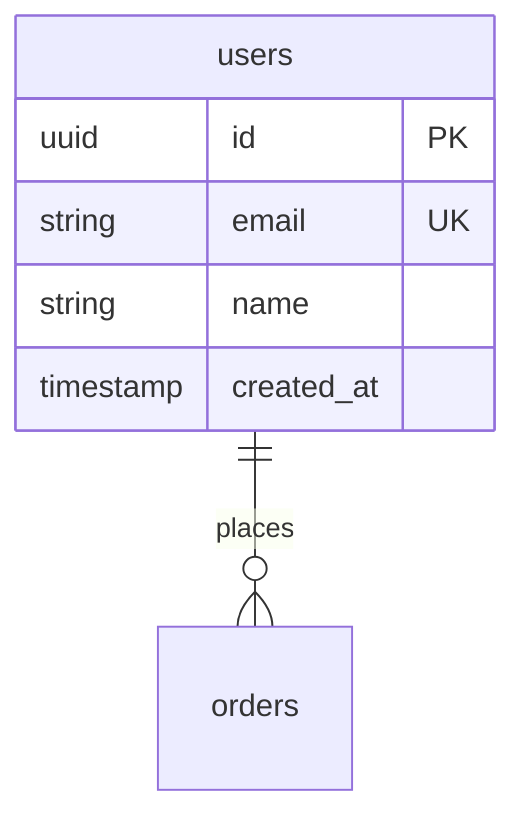

# Database Standards

DBA 에이전트가 참조하는 데이터베이스 설계 기준.

## 네이밍 컨벤션

| 대상 | 규칙 | 예시 |
|-----|------|------|
| 테이블 | snake_case, 복수형 | `users`, `order_items` |
| 컬럼 | snake_case | `created_at`, `user_id` |
| PK | `id` 또는 `{table}_id` | `id`, `user_id` |
| FK | `{참조테이블단수}_id` | `user_id`, `order_id` |
| 인덱스 | `idx_{table}_{columns}` | `idx_users_email` |
| 제약조건 | `{type}_{table}_{column}` | `uk_users_email` |

## 필수 컬럼

모든 테이블에 포함:

```sql
id          UUID PRIMARY KEY DEFAULT gen_random_uuid(),
created_at  TIMESTAMP WITH TIME ZONE NOT NULL DEFAULT NOW(),
updated_at  TIMESTAMP WITH TIME ZONE NOT NULL DEFAULT NOW()
```

Soft Delete 사용 시: `deleted_at TIMESTAMP WITH TIME ZONE NULL`

## 데이터 타입 선택

| 용도 | 권장 타입 | 비권장 | 이유 |
|-----|---------|-------|------|
| PK | UUID | AUTO_INCREMENT | 분산 환경, 보안 |
| 금액 | DECIMAL(19,4) | FLOAT | 정밀도 |
| 날짜시간 | TIMESTAMPTZ | TIMESTAMP | 시간대 |
| 상태 | VARCHAR(20) | ENUM | 유연성 |
| JSON | JSONB | JSON | 인덱싱 |
| 텍스트 | TEXT | VARCHAR(MAX) | 가독성 |

## 인덱스 전략

| 상황 | 인덱스 유형 | 예시 |
|-----|-----------|------|
| 동등 검색 | B-Tree | `WHERE email = ?` |
| 범위 검색 | B-Tree | `WHERE created_at > ?` |
| 전문 검색 | GIN/GiST | `WHERE name @@ ?` |
| 배열/JSON | GIN | `WHERE tags @> ?` |
| 정렬 | B-Tree (순서 포함) | `ORDER BY created_at DESC` |

## 성능 기준 (NFR)

| 쿼리 유형 | 목표 | 경고 | 위험 |
|---------|:----:|:----:|:----:|
| 단순 조회 (PK) | < 10ms | > 50ms | > 100ms |
| 복합 조회 | < 100ms | > 200ms | > 500ms |
| 집계 쿼리 | < 500ms | > 1s | > 3s |
| 리포트 | < 5s | > 10s | > 30s |

## 커넥션 관리

| 환경 | 최소 | 최대 |
|-----|:----:|:----:|
| Development | 5 | 10 |
| Staging | 10 | 20 |
| Production | 20 | 100 (인스턴스당) |

## 출력 형식: ERD (Mermaid)



## 출력 형식: 테이블 정의

| 컬럼 | 타입 | 제약조건 | 설명 |
|-----|------|---------|------|
| id | UUID | PK | 고유 식별자 |
| email | VARCHAR(255) | NOT NULL, UNIQUE | 이메일 |
