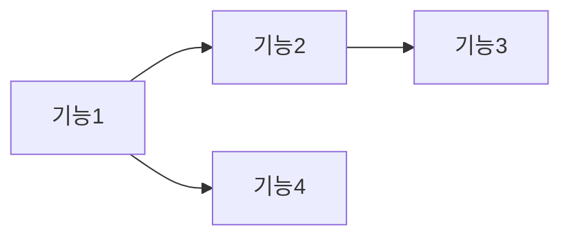

# 기능 명세서 (Functional Specification)

> 사용자 관점에서 시스템이 어떻게 동작해야 하는지 정의합니다.
> Requirements.md의 기능 요건을 구체적인 시나리오로 풀어낸 문서입니다.

---

## 1. 문서 개요

### 1.1 목적
이 문서는 {{PROJECT_NAME}}의 기능을 사용자 시나리오 관점에서 상세히 기술합니다.

### 1.2 범위
- [requirements.md](./requirements.md)의 기능 요건 (FR-XXX) 구체화
- 사용자 인터랙션 흐름
- 예외 처리 시나리오
- 비즈니스 규칙

### 1.3 용어
→ [glossary.md](./glossary.md) 참조

---

## 2. 기능 목록

| ID | 기능명 | 요건 참조 | 우선순위 | 상태 |
|----|-------|----------|:--------:|:----:|
| FS-001 | | FR-001 | Must | 초안 |
| FS-002 | | FR-002 | Must | 초안 |

---

## 3. 기능 상세

### FS-001: [기능명]

#### 3.1.1 개요

| 항목 | 내용 |
|-----|------|
| **요건 참조** | FR-001 |
| **우선순위** | Must |
| **관련 화면** | [ui-ux-spec.md#화면ID](./ui-ux-spec.md) |
| **관련 API** | [service-spec.md#API명](./service-spec.md) |

#### 3.1.2 사용자 스토리

```
As a [사용자 역할]
I want to [원하는 것]
So that [이유/가치]
```

#### 3.1.3 사전 조건 (Preconditions)

- [ ] 조건 1
- [ ] 조건 2

#### 3.1.4 기본 흐름 (Happy Path)

```
1. 사용자가 [행동]
2. 시스템이 [반응]
3. 사용자가 [행동]
4. 시스템이 [결과]
```

| 단계 | 사용자 행동 | 시스템 반응 | 비고 |
|:---:|-----------|-----------|------|
| 1 | | | |
| 2 | | | |
| 3 | | | |

#### 3.1.5 대안 흐름 (Alternative Flow)

**AF-001: [대안 시나리오명]**

| 분기점 | 조건 | 흐름 |
|:------:|-----|------|
| 단계 2 | [조건] | [대안 흐름 설명] |

#### 3.1.6 예외 흐름 (Exception Flow)

**EF-001: [예외 시나리오명]**

| 분기점 | 예외 조건 | 시스템 반응 | 에러 코드 |
|:------:|---------|-----------|----------|
| 단계 2 | [조건] | [에러 메시지] | ERR_XXX |

→ 에러 코드 상세: [error-codes.md](./error-codes.md)

#### 3.1.7 사후 조건 (Postconditions)

- [ ] 결과 1
- [ ] 결과 2

#### 3.1.8 비즈니스 규칙

| 규칙 ID | 규칙 | 예외 |
|--------|------|------|
| BR-001 | | |
| BR-002 | | |

#### 3.1.9 수용 조건 (Acceptance Criteria)

```gherkin
Feature: [기능명]

  Scenario: [시나리오명]
    Given [사전 조건]
    When [행동]
    Then [기대 결과]

  Scenario: [예외 시나리오]
    Given [사전 조건]
    When [예외 행동]
    Then [예외 결과]
```

---

### FS-002: [기능명]

(위와 동일한 형식으로 작성)

---

## 4. 기능 간 의존성



| 기능 | 선행 기능 | 후행 기능 |
|-----|----------|----------|
| FS-001 | - | FS-002, FS-004 |
| FS-002 | FS-001 | FS-003 |

---

## 5. 비기능 요건 매핑

| 기능 | 관련 NFR | 제약 사항 |
|-----|---------|----------|
| FS-001 | NFR-001 (응답시간 < 200ms) | |
| FS-002 | NFR-002 (동시 사용자 1000명) | |

→ NFR 상세: [requirements.md#비기능요건](./requirements.md)

---

## 6. 용어 참조

이 문서에서 사용된 도메인 용어:
→ [glossary.md](./glossary.md)

---

## 7. 관련 문서

- [PRD](./prd.md) - 제품 요구사항
- [요구사항](./requirements.md) - 기능/비기능 요건
- [UI/UX 명세](./ui-ux-spec.md) - 화면 설계
- [서비스 명세](./service-spec.md) - API 정의
- [에러 코드](./error-codes.md) - 에러 정의

---

## 변경 이력

| 버전 | 날짜 | 작성자 | 변경 내용 |
|------|------|--------|----------|
| 1.0.0 | {{DATE}} | tsq-planner | 초기 작성 |
