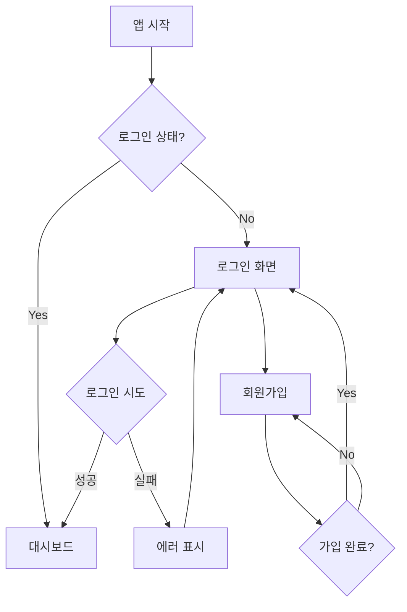
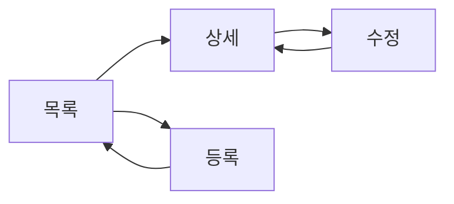

# UI/UX 명세서

> 사용자 인터페이스와 사용자 경험을 정의합니다.
> 와이어프레임, 화면 흐름, 인터랙션 패턴을 문서화합니다.

---

## 1. 디자인 원칙

### 1.1 UX 원칙

| 원칙 | 설명 | 적용 예시 |
|-----|------|----------|
| 일관성 | 동일한 요소는 동일하게 동작 | 버튼 스타일, 폼 레이아웃 |
| 피드백 | 사용자 행동에 즉각 반응 | 로딩 표시, 성공/실패 메시지 |
| 단순성 | 핵심 기능에 집중 | 불필요한 요소 제거 |
| 접근성 | 모든 사용자가 사용 가능 | 키보드 네비게이션, 스크린리더 |

### 1.2 디자인 시스템

| 요소 | 정의 | 토큰/값 |
|-----|------|--------|
| Primary Color | 주요 액션 색상 | #3B82F6 |
| Secondary Color | 보조 색상 | #6B7280 |
| Error Color | 에러 표시 | #EF4444 |
| Success Color | 성공 표시 | #10B981 |
| Font Family | 기본 폰트 | Inter, system-ui |
| Border Radius | 모서리 둥글기 | 8px |

---

## 2. 화면 구조

### 2.1 사이트맵

```
[홈]
├── [인증]
│   ├── 로그인
│   ├── 회원가입
│   └── 비밀번호 찾기
├── [대시보드]
│   ├── 개요
│   └── 통계
├── [기능1]
│   ├── 목록
│   ├── 상세
│   └── 등록/수정
└── [설정]
    ├── 프로필
    └── 알림
```

### 2.2 화면 목록

| 화면 ID | 화면명 | URL | 인증 필요 | 관련 기능 |
|--------|-------|-----|:--------:|----------|
| SCR-001 | 로그인 | /login | N | FS-001 |
| SCR-002 | 대시보드 | /dashboard | Y | FS-002 |
| SCR-003 | | | | |

---

## 3. 화면 상세

### SCR-001: 로그인

#### 3.1.1 기본 정보

| 항목 | 내용 |
|-----|------|
| **화면명** | 로그인 |
| **URL** | /login |
| **접근 권한** | 비회원 |
| **관련 기능** | [FS-001](./functional-spec.md#FS-001) |
| **관련 API** | [POST /api/auth/login](./service-spec.md) |

#### 3.1.2 와이어프레임

```
┌─────────────────────────────────────────┐
│              [로고]                      │
│                                         │
│  ┌─────────────────────────────────┐   │
│  │ 이메일                           │   │
│  └─────────────────────────────────┘   │
│                                         │
│  ┌─────────────────────────────────┐   │
│  │ 비밀번호                  [👁]  │   │
│  └─────────────────────────────────┘   │
│                                         │
│  ☐ 로그인 상태 유지                     │
│                                         │
│  ┌─────────────────────────────────┐   │
│  │           로그인                 │   │
│  └─────────────────────────────────┘   │
│                                         │
│  비밀번호 찾기  |  회원가입             │
│                                         │
│  ─────────── 또는 ───────────          │
│                                         │
│  [Google 로그인] [Apple 로그인]         │
│                                         │
└─────────────────────────────────────────┘
```

#### 3.1.3 UI 요소

| 요소 | 타입 | 필수 | 유효성 검사 | 에러 메시지 |
|-----|------|:----:|-----------|-----------|
| 이메일 | Input (email) | Y | 이메일 형식 | "올바른 이메일을 입력하세요" |
| 비밀번호 | Input (password) | Y | 최소 8자 | "비밀번호를 입력하세요" |
| 로그인 유지 | Checkbox | N | - | - |
| 로그인 버튼 | Button (primary) | - | - | - |

#### 3.1.4 인터랙션

| 트리거 | 액션 | 결과 |
|-------|------|------|
| 로그인 버튼 클릭 | API 호출 | 성공: 대시보드 이동 / 실패: 에러 표시 |
| 비밀번호 보기 클릭 | 토글 | 비밀번호 표시/숨김 |
| 회원가입 링크 클릭 | 네비게이션 | 회원가입 화면 이동 |

#### 3.1.5 상태별 화면

| 상태 | 설명 | UI 변화 |
|-----|------|--------|
| 기본 | 초기 상태 | 빈 폼 |
| 로딩 | API 호출 중 | 버튼 비활성화 + 스피너 |
| 에러 | 인증 실패 | 에러 메시지 표시 (빨간색) |
| 성공 | 인증 성공 | 대시보드로 리다이렉트 |

#### 3.1.6 반응형

| 브레이크포인트 | 레이아웃 변경 |
|--------------|-------------|
| Desktop (≥1024px) | 중앙 정렬, 최대 너비 400px |
| Tablet (768-1023px) | 중앙 정렬, 패딩 조정 |
| Mobile (<768px) | 전체 너비, 패딩 16px |

---

### SCR-002: [화면명]

(위와 동일한 형식으로 작성)

---

## 4. 공통 컴포넌트

### 4.1 네비게이션

```
┌─────────────────────────────────────────────────┐
│ [로고]    [메뉴1] [메뉴2] [메뉴3]    [프로필▼] │
└─────────────────────────────────────────────────┘
```

### 4.2 푸터

```
┌─────────────────────────────────────────────────┐
│ 이용약관 | 개인정보처리방침 | 고객센터           │
│ © 2026 {{PROJECT_NAME}}. All rights reserved.  │
└─────────────────────────────────────────────────┘
```

### 4.3 모달

| 타입 | 용도 | 크기 |
|-----|------|------|
| Alert | 단순 알림 | Small (300px) |
| Confirm | 확인 요청 | Small (300px) |
| Form | 폼 입력 | Medium (500px) |
| Full | 복잡한 작업 | Large (800px) |

### 4.4 토스트/알림

| 타입 | 색상 | 지속 시간 | 예시 |
|-----|------|---------|------|
| Success | Green | 3초 | "저장되었습니다" |
| Error | Red | 5초 | "오류가 발생했습니다" |
| Warning | Yellow | 4초 | "저장하지 않은 변경사항이 있습니다" |
| Info | Blue | 3초 | "새로운 알림이 있습니다" |

---

## 5. 화면 흐름

### 5.1 인증 흐름



### 5.2 주요 기능 흐름



---

## 6. 접근성 (Accessibility)

### 6.1 WCAG 준수 항목

| 기준 | 레벨 | 적용 |
|-----|:----:|------|
| 키보드 접근성 | A | 모든 기능 키보드로 사용 가능 |
| 색상 대비 | AA | 텍스트 4.5:1 이상 |
| 대체 텍스트 | A | 모든 이미지에 alt 속성 |
| 포커스 표시 | AA | 포커스 상태 명확히 표시 |

### 6.2 스크린리더 지원

| 요소 | aria 속성 | 예시 |
|-----|----------|------|
| 버튼 | aria-label | `aria-label="로그인"` |
| 폼 | aria-describedby | 에러 메시지 연결 |
| 모달 | role="dialog" | 포커스 트랩 |

---

## 7. 관련 문서

- [기능 명세](./functional-spec.md) - 기능 상세
- [서비스 명세](./service-spec.md) - API 정의
- [에러 코드](./error-codes.md) - 에러 메시지

---

## 변경 이력

| 버전 | 날짜 | 작성자 | 변경 내용 |
|------|------|--------|----------|
| 1.0.0 | {{DATE}} | tsq-planner | 초기 작성 |
